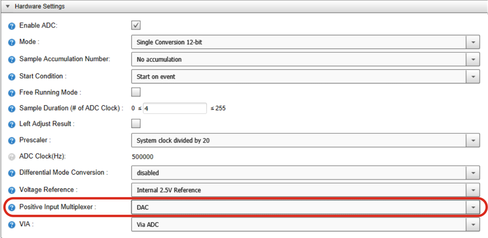

<!-- Please do not change this logo with link -->

# ATtiny1627 Programmable Gain Amplifier Demonstration

This code example demonstrates the Programmable Gain Amplifier (PGA) feature inside the Analog-to-Digital Converter (ADC) of the ATtiny1627 family of microcontrollers.

## Related Documentation

- [ATtiny1627 Microcontroller Product Page](https://www.microchip.com/wwwproducts/en/ATTINY1627)

## Software Used

- [MPLAB® X IDE v5.45 or newer](http://www.microchip.com/mplab/mplab-x-ide)
- [MPLAB XC8 v2.31 or newer](http://www.microchip.com/mplab/compilers)
- [MPLAB Code Configurator (MCC) v5.0.2 or newer](https://www.microchip.com/mplab/mplab-code-configurator)
- [MPLAB Data Visualizer](https://www.microchip.com/en-us/development-tools-tools-and-software/embedded-software-center/mplab-data-visualizer) or alternative serial COM port terminal
- [MPLAB Code Configurator (MCC) Device Libraries 8-bit AVR MCUs v2.7.0](https://www.microchip.com/mplab/mplab-code-configurator)
- [Microchip ATtiny_DFP (v2.5.116) or newer](https://packs.download.microchip.com/)

## Hardware Used

- [ATtiny1627 Curiosity Nano (P/N: DM080104)](https://www.microchip.com/DevelopmentTools/ProductDetails/PartNO/DM080104)

## Setup

This demonstration only requires the ATtiny1627 Curiosity Nano connected to a PC via USB.

**The baud rate for the board is 115200, no parity, and 1 stop bit.**

To setup MPLAB Data Visualizer as a serial terminal:
1. Plug in the ATtiny1627 Curiosity Nano.  
2. Click on the plugin icon in the MPLAB X IDE toolbar.

3. Select the Curiosity Nano in the COM port list, but do not connect to it.

4. In the lower left corner of the screen setup the baud rate and bit settings as shown.

5. Press the play button next to the name to connect to the COM port.

6. In the terminal viewer, select the connected COM port in source options.  

## Operation

The ATtiny1627 contains a capacitive-based PGA that is capable of amplifying small signals in order to improve signal resolution in the ADC. For this demonstration, the internal signal `VDD/10` is measured. However, using MPLAB Code Configurator (MCC), the positive input channel can be changed to an external pin. Any signal applied to this pin should not exceed the maximum ratings specified in the datasheet.

**Note: If any changes are made to the MCC, the configuration must be re-generated to change the API's behavior.**

  
*Figure 1 - Positive Input Multiplexer Setting*

The voltage reference level used by the ADC can also be changed. Smaller voltage references have better measurement resolution, while larger references have a wider input span. A voltage reference larger than the supply voltage of the microcontroller cannot be used.

**Note: The external VREF and VDD options produce a result relative to their value, e.g.: 20% (of VDD).**

To demonstrate the PGA, the PGA is used to multiply the input signal (as provided VDD/10). The gain of the PGA was set to 2x, but the PGA gain can be set as high as 16x. However, using other gain values may require adjustments to the sampling time of the ADC.

To trigger the ADC, the Event System was used to connect the Periodic Interrupt Timer (PIT) to the ADC Start Trigger. The PIT runs at 1kHz, but is divided by 2048 in the event channel. This creates a period of approximately 2 seconds between each conversion. LED0 on the Curiosity Nano is also connected to the same event channel. Visually, every time the LED on the Curiosity Nano goes from ON to OFF, the ADC is triggered.

For simplicity, the microcontroller remains in sleep most of the time. When the ADC completes the conversion, the interrupt generated wakes the microcontroller from sleep to process the result. After processing and printing the result, the microcontroller goes back to sleep to wait for the next cycle.

  
*Figure 2 - Output from the Example. VREF = 2.5V, VDD = 5V*

**Note: VDD on the Curiosity Nano is 3.3V by default.**

One downside of this approach is that the program becomes sensitive to interrupts. As an example, moving to interrupt driven UART would trigger the program to run early, causing the output to duplicate infinitely. One workaround would be to set (and clear) a software flag that is triggered from the ADC's interrupt.

## Changing VDD on the Curiosity Nano

Curiosity Nano development boards ship running at 3.3V. To change the operating voltage to 5V (or another level), please consult section 3.3 in the [ATtiny1627 Curiosity Nano User's Guide](http://www.microchip.com/mymicrochip/filehandler.aspx?ddocname=en1002865).

## Summary

This code example demonstrates the Programmable Gain Amplifier in the ATtiny1627 family of microcontrollers.
